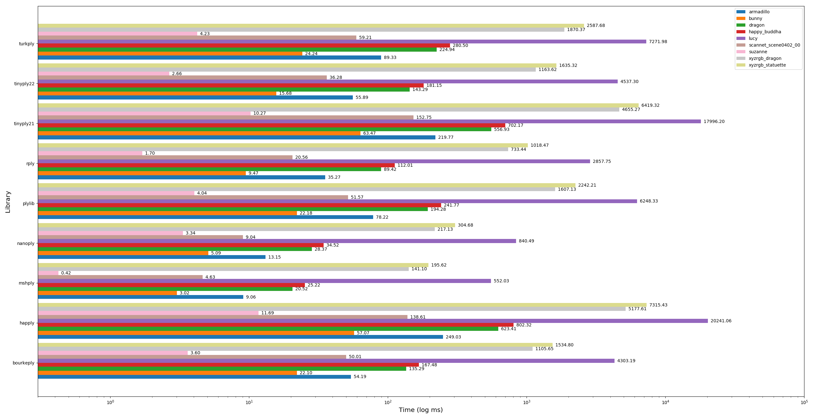
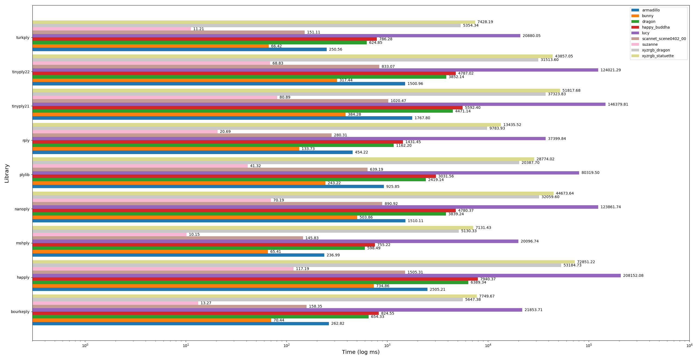
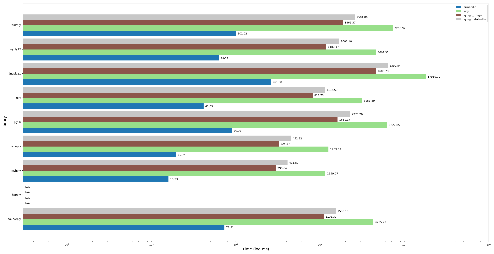

# Ply File I/O Benchmark

This repository contains a code for comparison of various libraries for input and output of PLY files. [PLY file format](https://en.wikipedia.org/wiki/PLY_(file_format)) has been developed at Stanford University by [Greg Turk](https://www.cc.gatech.edu/~turk/) as a part of the [real-world object digitization project](http://graphics.stanford.edu/data/3Dscanrep/) undertaken by Stanford University in mid-90s.

## Task
The task is to read and write a basic triangle mesh stored in a PLY file into memory. The triangle mesh is represented as a list of vertices and a list of indices into that list, indicating which triplets of vertices make a triangle. 

The data structure we wish to populate is:
~~~~
typedef struct vec3f
{
  float x,y,z;
} Vec3f;

typedef struct tri
{
  int index1, index2, index3;
} Tri;

typedef struct triangle_mesh
{
  int n_verts;
  int n_faces;
  Vec3f* vertices;
  Tri* faces;
} TriMesh;
~~~~

The meshes we are testing were processed to contain only the position attribute and only triangles. As such this task aims to measure the speed at which each library is able to exchange simple triangular mesh data. Each of the meshes is tested using both binary and text(ASCII) formats, as supported by PLY file format. 

For performance on an alternative task where non-trianglar meshes with more per-vertex attributes are tested, see [Vilya Harvey's ply-parsing-perf](https://github.com/vilya/ply-parsing-perf).  

### Test Models

Table below lists models used for this benchmark, along with the source.

|     Model Name                | N. Vertices |  N. Tris | Source |
|:-----------------------------:|:-----------:|:--------:|:------:|
| suzanne                       |        7958 |    15744 | Blender
| scannet_scene0402_00          |       93834 |   177518 | [Scannet](http://www.scan-net.org/)
| angel                         |      237018 |   474048 | [Large Geometric Models Archvive]
| blade                         |      882954 |  1765388 | [Large Geometric Models Archvive]
| hand                          |      327323 |   654666 | [Large Geometric Models Archvive]
| horse                         |      48485  |    96966 | [Large Geometric Models Archvive]
| armadillo                     |      172974 |   345944 | [Stanford 3D Scaning Repository]
| bunny                         |       35947 |    69451 | [Stanford 3D Scaning Repository]
| dragon                        |      437645 |   871414 | [Stanford 3D Scaning Repository]
| happy_buddha                  |      543652 |  1087716 | [Stanford 3D Scaning Repository]
| lucy                          |    14027872 | 28055742 | [Stanford 3D Scaning Repository]
| xyzrgb_dragon                 |     3609600 |  7219045 | [Stanford 3D Scaning Repository]
| xyzrgb_statuette              |     4999996 | 10000000 | [Stanford 3D Scaning Repository]
| bust_of_sappho                |      140864 |   281724 | [Thingiverse](https://www.thingiverse.com/thing:14565)
| statue                        |      999517 |  1999038 | [Sketchfab](https://sketchfab.com/3d-models/william-huskisson-statue-ee9ce7c99f2d4b40aa46aaffb02bf21d)
| speeder_bike                  |     1473341 |  2947046 | [Sketchfab](https://sketchfab.com/3d-models/speeder-bike-from-star-wars-galaxys-edge-dcddea22a0674737b4201a025a27a94d)
| armchair                      |       11558 |    23102 | [Sketchfab](https://sketchfab.com/3d-models/lounger-armchair-e9d9d87c32f144e2873765e66814f727)
| bust_of_angelique_dhannetaire |      250000 |   500000 | [Sketchfab](https://sketchfab.com/3d-models/bust-of-angelique-dhannetaire-26c23265310a4e45aaa296d02db83cb2)

## Libraries

Below is a list of libraries used in this benchmark:

- [turkply](https://people.sc.fsu.edu/~jburkardt/c_src/ply_io/ply_io.html) - original PLY library by Greg Turk 

- [bourkeply](http://paulbourke.net/dataformats/ply/) - as far as I can tell it is a Paul Bourke modification of the original Turk's code 
 
- [rply](http://w3.impa.br/~diego/software/rply/) - a PLY I/O library by Diego Nehab

- [msh_ply](https://github.com/mhalber/msh) - a single-header c PLY I/O library by myself

- [happly](https://github.com/nmwsharp/happly) - a single-header c++ PLY I/O library by Nicolas Sharp

- [miniply](https://github.com/vilya/miniply) - a PLY reading library by Vilya Harper

- [nanoply](https://github.com/cnr-isti-vclab/vcglib/tree/master/wrap/nanoply) - a single-header c++ PLY I/O library taken from vcglib

- [plylib](https://github.com/cnr-isti-vclab/vcglib/tree/master/wrap/ply) - a PLY I/O library taken from vcglib (PLY reading/writing used by Meshlab(?) )

- [tinyply](https://github.com/ddiakopoulos/tinyply) - a PLY I/O library by Dimitri Diakopoulos. This benchmark includes versions 2.1, 2.2 and 2.3 of the library

For the usage example, as well as some additional comments about each of the libraries please check the *_test.c(pp) files.

## Results

Below we present results for parsing PLY files storing data in both ASCII and binary format (little endian). Times are given in milliseconds. Highlighted numbers indicate the best method in each category.

The benchmark was compiled using gcc 8.3, with -O3 level of optimization.

*Disclamer: I am the author of msh_ply library. If you see any deficiencies in code for other libraries, don't hesitate to let me know - I hope to make this benchmark as fair as possible.*

### Average Read Times

|Method     |           ASCII    |           Binary   |
|----------:|-------------------:|-------------------:|
|bourkeply  |    2477.431 (8.3x) |     508.893 (8.9x) |
|happly     |  24713.890 (82.7x) |   2318.877 (40.5x) |
|miniply    |  **298.979 (1.0x)**|      72.775 (1.3x) |
|mshply     |    2176.058 (7.3x) |   **57.250 (1.0x)**|
|nanoply    |  13979.778 (46.8x) |      93.578 (1.6x) |
|plylib     |   9605.602 (32.1x) |    631.308 (11.0x) |
|rply       |   3945.454 (13.2x) |     298.244 (5.2x) |
|tinyply21  |  15835.790 (53.0x) |   1821.167 (31.8x) |
|tinyply22  |  13637.762 (45.6x) |     423.470 (7.4x) |
|tinyply23  |  13603.095 (45.5x) |     543.307 (9.5x) |
|turkply    |    2377.470 (8.0x) |    832.714 (14.5x) |

### Average Write Times

|Method     |           ASCII    |           Binary   |
|----------:|-------------------:|-------------------:|
|bourkeply  |     696.566 (3.6x) |      318.284(1.7x) | <!-- Does this even work >
|happly     |   2097.650 (10.7x) |    1912.975(10.1x) |
|miniply    |                N/A |                N/A |
|mshply     | **195.249 (1.0x)** | **189.043(1.0x)** |
|nanoply    |   5211.672 (26.7x) |   5244.949(27.7x) |
|plylib     |     373.957 (1.9x) |    373.507(2.0x)  |
|rply       |     236.461 (1.2x) |    236.181(1.2x)  |
|tinyply21  |    1194.343 (6.1x) |   1196.465(6.3x)  |
|tinyply22  |     665.850 (3.4x) |    671.993(3.6x)  |
|tinyply23  |     666.219 (3.4x) |    717.330(3.8x)  |
|turkply    |     751.583 (3.8x) |    735.753(3.9x)  | <!-- Does this even work >

*Note: miniply does not support writing of ply files.*

### Per model read times:

[Read Times Table]() [Read Times Image]()
[Write Times Table]() [Write Times Image]()

<!-- 

This repository contains a simple benchmark comparing various libraries for input/output of ply files. 

For this benchmark we use models from the [Stanford 3D Scaning Repository](http://graphics.stanford.edu/data/3Dscanrep/), an example scan from [Scannet dataset](http://www.scan-net.org/) (scene_0402_00) and Suzanne model from Blender.
In addition to models provided in repository, we have added cube and subdivided suzanne models as a baseline. We have also added little endian variation of each model as well as ascii variation of armadillo. Variations were created
by exporting meshes using Meshlab.

The reading task is simply opening any of the input file and extracting the minimal __triangle__ mesh
information from it, that is vertex position buffer, fgace indices buffer, as well as counts of
each element.

The writing task is to write out the read file back as a little endian binary file.

**Model stats:**

## Libraries

Below is a list of libraries used in this benchmark:

- [turkply](https://people.sc.fsu.edu/~jburkardt/c_src/ply_io/ply_io.html) - original PLY library by Greg Turk 

- [rply](http://w3.impa.br/~diego/software/rply/) - a ply io library by Diego Nehab

- [msh_ply](https://github.com/mhalber/msh) - a single-header c ply io library by myself

- [happly](https://github.com/nmwsharp/happly) - a single-header c++ ply io library by Nicolas Sharp

- [nanoply](https://github.com/cnr-isti-vclab/vcglib/tree/master/wrap/nanoply) - a single-header c++ ply io library taken from vcglib

- [plylib](https://github.com/cnr-isti-vclab/vcglib/tree/master/wrap/ply) - a ply io library taken from vcglib (meshlab ply io(?))

- [tinyply](https://github.com/ddiakopoulos/tinyply) - a ply io library by Dimitri Diakopoulos. This benchmark includes versions 2.1 and 2.2 of the library

For an example of usage of each library, as well as some additional comments about each of the libraries please check the *_test.c(pp) files.

### Timing plots
Below we provide timing plots showing read times for different librarties and models, in log-scale.

Little Endian Read Times:

Ascii Read Times:

Big Endian Read Times:

## Exact Timings

All tests were performed using MSI GS5 laptop with i7-8750H, 16GB of ram and a SATA SSD.

All programs were compiled gcc 7.3, with -O2 flag.

Each program was run 10 times for each model. Numbers reported below are average timings in milliseconds.
First number is the read time and second number is the write time.

Notes:

- turkply and bourkeply libraries seem to have issues with writing binary files. As such they are missing the write times.
- happly does not support reading big endian files. As such timings there are missing.

Little endian:

|           |            armadillo |                bunny |               dragon |         happy_buddha |                   lucy | scannet_scene0402_00 |              suzanne |        xyzrgb_dragon |     xyzrgb_statuette |
|----------:|:--------------------:|:--------------------:|:--------------------:|:--------------------:|:--------------------:|:----------------------:|:--------------------:|:--------------------:|:--------------------:|
|bourkeply  |    54.191/--         |    22.099/--         |      135.289/--      |   167.482/--         |  4303.187/--         |    50.011/--           |     3.602/--         |  1105.653/--         |  1534.796/--         |
|happly     |   249.025/608.109    |    57.071/50.427     |   623.411/676.738    |   802.318/779.508    | 20241.057/18520.934  |   138.60  118.645      |    11.689/15.040     |  5177.612/4798.132   |  7315.427/6751.995   |
|mshply     |     9.064/12.730     |     3.019/8.223      |    20.524/28.852     |    25.224/28.253     |   552.029/1887.717   |     4.632/8.586        |     0.422/5.219      |   141.102/426.545    |   195.617/627.227    |
|nanoply    |    13.150/631.481    |     5.094/135.467    |    28.367/1662.330   |    34.518/2072.149   |   840.490/54224.268  |     9.03/316.843       |     3.336/37.966     |   217.133/13579.873  |   304.678/19162.336  |
|plylib     |    78.215/54.818     |    22.175/16.595     |   194.284/143.898    |   241.768/173.268    |  6248.333/4257.681   |    51.572/28.413       |     4.036/7.201      |  1607.128/1190.885   |  2242.205/1609.021   |
|rply       |    35.266/37.930     |     9.469/13.486     |    89.424/103.171    |   112.010/123.104    |  2857.748/3080.997   |    20.558/21.464       |     1.702/6.209      |   733.440/808.934    |  1018.465/1201.056   |
|tinyply21  |   219.774/156.244    |    63.475/36.680     |   556.931/428.808    |   702.175/503.947    | 17996.200/12984.814  |   152.750/84.813       |    10.271/11.743     |  4655.274/3419.585   |  6419.324/4685.089   |
|tinyply22  |   108.763/98.938     |    30.543/24.494     |   274.517/304.301    |   342.520/337.396    |  8694.781/8009.255   |    70.182/51.364       |     4.979/8.776      |  2247.655/2235.497   |  3110.161/2897.603   |
|turkply    |    89.327/--         |    24.245/--         |       224.943/--     |   280.503/--         |  7271.984/--         |    59.205/--           |     4.234/--         |  1870.365/--         |  2587.685/--         |

Ascii:

|           |              armadillo |                  bunny |                 dragon |           happy_buddha |                   lucy |   scannet_scene0402_00 |                suzanne |          xyzrgb_dragon |       xyzrgb_statuette |
|----------:|:----------------------:|:----------------------:|:----------------------:|:----------------------:|:----------------------:|:----------------------:|:----------------------:|:----------------------:|:----------------------:|
|bourkeply  |   262.819/204.076    |    70.442/23.625     |   654.335/260.768    |   824.554/275.882    | 21853.705/6777.179   |   158.350/47.641     |    13.274/8.607      |  5647.376/1834.204   |  7749.668/2499.985   |
|happly     |  2505.206/232.919    |   734.863/52.144     |  6389.338/578.777    |  7940.365/812.902    |208152.084/18592.531  |  1505.30/134.693    |   117.188/15.123     | 53184.730/4805.273   | 72851.223/6720.681   |
|mshply     |   236.991/14.432     |    65.407/8.305      |   598.492/93.579     |   755.221/28.752     | 20096.744/1888.824   |   145.832/12.998     |    10.152/5.287      |  5130.331/441.469    |  7131.428/632.602    |
|nanoply    |  1510.109/622.256    |   503.860/136.019    |  3839.242/1656.114   |  4780.373/2071.453   |123861.742/53573.014  |   890.91/325.978    |    70.192/36.971     | 32059.599/13651.622  | 44673.635/19181.624  |
|plylib     |   925.847/57.476     |   243.220/16.458     |  2419.141/144.381    |  3031.561/162.190    | 80319.501/4254.370   |   639.185/32.552     |    41.323/6.973      | 20387.697/1188.994   | 28774.019/1646.837   |
|rply       |   454.223/78.701     |   133.727/13.406     |  1162.198/111.941    |  1431.447/117.718    | 37399.843/2998.422   |   280.312/23.745     |    20.694/6.344      |  9783.927/887.364    | 13435.522/1066.476   |
|tinyply21  |  1767.797/162.594    |   384.277/36.426     |  4471.137/474.566    |  5592.396/505.591    |146379.814/13021.023  |  1020.473/88.871     |    80.891/12.397     | 37323.829/3391.234   | 51817.681/4682.880   |
|tinyply22  |  1681.693/100.368    |   362.111/24.779     |  4295.324/428.578    |  5337.179/313.325    |138053.700/7930.052   |   939.365/60.822     |    75.782/8.891      | 35168.252/2097.884   | 48825.714/2898.571   |
|turkply    |   250.565/135.443    |    66.422/22.879     |   624.849/338.927    |   786.279/299.251    | 20880.050/7186.658   |   151.111/57.840     |    11.212/8.507      |  5354.337/1915.744   |  7428.192/2655.605   |

Big endian:

|           |              armadillo |                   lucy |          xyzrgb_dragon |       xyzrgb_statuette |
|----------:|:----------------------:|:----------------------:|:----------------------:|:----------------------:|
|bourkeply  |    73.514/--      |  4285.232/--       |  1106.368/--      |  1539.191/--      |
|happly     |     --/--      |     --/--      |     --/--      |     --/--      |
|mshply     |    15.934/12.149     |  1159.065/1889.036   |   298.641/427.111    |   411.568/632.299    |
|nanoply    |    19.742/653.020    |  1259.320/54102.421  |   325.375/13594.291  |   452.822/19115.148  |
|plylib     |    90.064/53.617     |  6227.848/4344.894   |  1611.174/1177.780   |  2270.258/1626.401   |
|rply       |    41.628/36.521     |  3151.893/2988.477   |   818.731/786.649    |  1136.587/1115.488   |
|tinyply21  |   261.581/199.009    | 17980.700/13021.739  |  4603.731/3395.731   |  6390.837/4698.750   |
|tinyply22  |   123.779/96.806     |  8778.916/7967.362   |  2263.262/2243.761   |  3135.846/2898.244   |
|turkply    |   101.015/--      |  7266.968/--      |  1869.368/--     |  2584.856/--      |

## LOC

Another metric we can use for deciding a library is ease of use. Why LOC is by no
means a perfect metric to measure ease of use, it does reflect how much code one needs to
type to get basic ply reading done. Also note that these numbers report only simple versions
of read function without any error reporting etc.

|  Library  |   Read LOC  | Write LOC |
|:---------:|:-----------:|:---------:|
| bourkeply |    55       |   33      |
| mshply    |    24       |   24      |
| nanoply   |    23       |   29      |
| plylib    |    78       |   65*     |
| rply      |    69       |   23      |
| happly    |  **17**     |   26      |
| tinyply   |  **17**     | **10**    |
| turkply   |    52       |   39      |

\* - plylib does not support writing files explicitly. I have simply copied and simplified **Save** function from
[vcglib source](https://github.com/cnr-isti-vclab/vcglib/blob/master/wrap/io_trimesh/export_ply.h). 

## Notes

1. The speed of msh_ply for triangular meshes comes from the list size hint - if provided program can assume that all faces have constant number of vertices and can just parse all vertex indices data in one go. I'll try to provide benchmark showing how not setting that variables affects the read result.

2. If you have any comments about/issues with the methodology used in this benchmark or would like to see additional libraries/models tested, please create an issue. I'd be very happy to improve this benchmark and make it more informative -->

[Large Geometric Models Archvive]: https://www.cc.gatech.edu/projects/large_models/index.html
[Stanford 3D Scaning Repository]: (http://graphics.stanford.edu/data/3Dscanrep/)